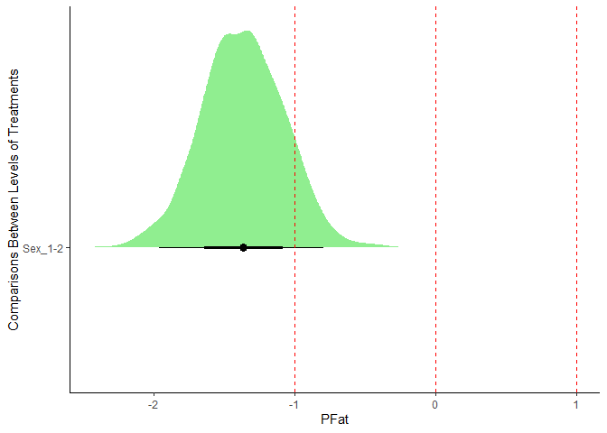

<!-- README.md is generated from README.Rmd. Please edit that file -->

# RabbitR

<!-- badges: start -->
<!-- badges: end -->

This is a teaching-oriented package for univariate linear mixed models
solved using Bayesian theory. The package includes visualization and
characterization of marginal posterior distributions of the estimates.

## Installation

You can install the development version of RabbitR from
[GitHub](https://github.com/) with:

``` r
# install.packages("devtools")
devtools::install_github("marinamartinezalvaro/RabbitR")
```

## Example

This is a basic example which shows you how to solve a common problem:

``` r
library(RabbitR)
#> 
#>            / \  / \
#>           (   \/   )
#>            \      /
#>             \ .. /
#>             (o Y o)
#>             /    \
#>            (      )
#>           /        \
#>          (          )
#>         ( (  )  (  ) )
#>          (__(__)__)
#>          ------------
#>         |   RabbitR  |
#>          ------------
#>   Welcome to RabbitR! Hop into the documentation with '??RabbitR'.
#> 
```

In this example, we are going to use DataIMF from RabbitR package.The
DataIMF dataset (502 observations across 8 variables) comes from three
generations of a divergent selection experiment for intramuscular fat in
rabbits.The data are based on perirenal fat (PFat), intramuscular fat
(IMF) and loin pH of rabbits belonging to both sexes (Sex), with an
specific live weight (LW). The data have been taken at different seasons
(AE, 2 levels) and rabbits were born at different parity orders (OP),and
have a random litter effect (c).This is how DataIMF looks like:

``` r
data(DataIMF)
head(DataIMF)
#>   AE OP LG Sex c   LW       pH   IMF  PFat
#> 1  1  1  1   1 1 1790     5.64 1.089  9.20
#> 2  1  1  1   1 2 1795     5.45 1.118 12.40
#> 3  1  1  1   1 3 1505 99999.00 0.939  3.10
#> 4  1  1  1   1 4 1870     5.64 1.229 13.82
#> 5  1  1  1   1 5 1725     5.51 1.068  7.01
#> 6  1  1  1   1 6 1570     5.44 1.439  8.20
```

We aim to explore the impact of Sex on IMF and PFat traits.
Additionally, we recognize the potential influence of the season when
data were collected, the parity order of the animals, the interaction
between season and Sex, their LW, and their common litter effects on
IMF, which necessitates adjustment. In this context, Sex is considered
our treatment of interest. Other fixed effects that require correction
but are not our primary focus are categorized as Noise effects (AE, OP,
and AE\*OP). Live Weight (LW) is a continuous trait and will thus be
treated as a covariate. Effects from common litter will be modeled as
random effects.

The RabbitR package supports univariate analysis, applying the same
univariate model across multiple traits:

IMF = m + Sex + AE + OP + AE\*Sex + b·LW + Rand(c) + e

PFat = m + Sex + AE + OP + AE\*Sex + b·LW + Rand(c) + e

To carry out our analysis, we’ll utilize the CreateParam, Bunny, and
Bayes functions. This workflow covers creating a parameter file
(CreateParam), executing general linear models and producing posterior
distributions (Bunny), and performing inferences (Bayes). For beginners
or those less familiar with R, interactive versions are available:
iCreateParam for CreateParam and iBayes for Bayes. Additionally, the
Rabbit function merges iCreateParam, Bunny, and iBayes into a
comprehensive, interactive tool, ideal for educational purposes.

Lets start creating our parameter file. To initiate our analysis, we’ll
create a parameter file using a CreateParam function. User can specify
Traits, Treatments, Noise, Interactions of order 2 between fixed effects
already declared, covariates, or random effects. You can define these
either by their column names in the data file (hTrait, hTreatment,
hNoise, hInter, hCov, hRand) or by their positions (pTrait, pTreatment,
pNoise, pInter, pCov, pRand), useful for analyzing multiple traits. The
askCompare argument lets you choose how to compare different treatment
levels (e.g., sex1 and Sex2) - as a difference (askCompare=“D”) or a
ratio (askCompare=“R”).

``` r

param_list<-CreateParam(
  file.name = "DataIMF",
  na.codes=c("99999"),
  hTrait = c("IMF", "PFat"),
  hTreatment = "Sex",
  askCompare="D",
  hNoise = c("AE", "OP"),
  hInter=matrix(c("AE","Sex"), nrow=1),
  ShowInter=c("N"),
  hCov = c("LW"),
  hRand = "c")
#> 
#> Let's create you Parameter file:
#> ---------------------------------------------------
#> 'data.frame':    502 obs. of  9 variables:
#>  $ AE  : int  1 1 1 1 1 1 1 1 1 1 ...
#>  $ OP  : int  1 1 1 1 1 1 1 1 1 1 ...
#>  $ LG  : int  1 1 1 1 1 1 1 1 1 1 ...
#>  $ Sex : int  1 1 1 1 1 1 1 1 1 1 ...
#>  $ c   : int  1 2 3 4 5 6 7 8 9 10 ...
#>  $ LW  : int  1790 1795 1505 1870 1725 1570 1780 1675 1870 1500 ...
#>  $ pH  : num  5.64 5.45 NA 5.64 5.51 5.44 5.47 5.45 5.53 5.5 ...
#>  $ IMF : num  1.089 1.118 0.939 1.229 1.068 ...
#>  $ PFat: num  9.2 12.4 3.1 13.82 7.01 ...
#> The number of rows in the data file is 502
#> See below the summary statistics of the traits:  IMF PFat
#> 
#> 
#> Table: Summary Statistics of Traits
#> 
#>              Mean          SD     Min   1st Qu..25%   Median   3rd Qu..75%     Max         CV   Missing Values
#> -----  ----------  ----------  ------  ------------  -------  ------------  ------  ---------  ---------------
#> IMF      1.180445   0.1640249   0.796         1.061   1.1655       1.28975    1.72   13.89517                8
#> PFat    10.620199   4.5220638   2.510         7.480   9.8000      12.91500   44.06   42.57984                0
#> The number of levels read in Treatments are: 2.
#> The number of levels read in Noise are: 2, 3. Contingency Tables across effects 
#> [1] "Sex vs AE"
#>       
#>        AE1 AE2
#>   Sex1 192  56
#>   Sex2 208  46
#>  Contingency Tables across effects 
#> [1] "Sex vs OP"
#>       
#>        OP1 OP2 OP3
#>   Sex1 219  27   2
#>   Sex2 223  29   2
#>  Contingency Tables across effects 
#> [1] "AE vs OP"
#>      
#>       OP1 OP2 OP3
#>   AE1 348  48   4
#>   AE2  94   8   0
#> See below the summary statitics of covariates:  LW
#> 
#> 
#> Table: Summary Statistics of Covariates
#> 
#>           Mean         SD    Min   1st Qu..25%   Median   3rd Qu..75%    Max         CV   Missing Values
#> ---  ---------  ---------  -----  ------------  -------  ------------  -----  ---------  ---------------
#> LW    1757.058   177.1815   1380          1630     1745          1880   2595   10.08399                0
#> The number of levels of Interaction 1 is 4.
#> Model equation for all Traits is : y = mean + Sex + AE + OP + b* LW + AE*Sex + Random(c)
#> [1] "Your parameter file its ready!"
```

Once the parameter file is ready, we can proceed to fit our model with
Bunny

``` r

bunny_results <- Bunny(params = param_list, Chain = FALSE)
#>  Bunny Starting ... 
#> 
#> 
#> Warning: Removed 0 rows due to missing values in model effects.
#> 
#> 
#> 
#> Analysis for Trait  IMF  in progress 
#> ---------------------------------------------------
#> 
#> 
#> Features of posterior samples:
#> ---------------------------------------------------
#> Number of iterations = 30000 
#> Burn-in = 5000 
#> Lag = 10 
#> Number of samples stored = 2500 
#> ---------------------------------------------------
#> 
#> 
#> Model Evaluation Criterion:
#> ---------------------------------------------------
#> DIC (Deviance Information Criterion) = -431.1114 
#> ---------------------------------------------------
#> 
#> 
#> 
#> Geweke's Convergence Diagnostics Z-Scores Summary:
#> ---------------------------------------------------
#> Effects Z-Scores:
#>   (Intercept): -0.188140562434191
#>   Sex2: 0.390522943859895
#>   AE2: 0.265425778583669
#>   OP2: -0.525059037982688
#>   OP3: 0.831908278154222
#>   LW: 0.310352349660083
#>   Sex2:AE2: -1.16600278004369
#> 
#> VarianceComponents Z-Scores:
#>   c: -2.35904680782234 (Potential issue with convergence)
#>   Ve: 2.55794016874722 (Potential issue with convergence)
#> 
#> Interpretation of Geweke's Z-Scores:
#> Z-scores within the range of -2 to 2 generally indicate that the chain has converged to the target distribution.
#> Z-scores outside this range may suggest issues with convergence, warranting further investigation.
#> ---------------------------------------------------
#> 
#> 
#> Computing Means... 
#> 
#> Means computed 
#> ---------------------------------------------------
#> 
#> Computing the Effects of Treatments... 
#> 
#> Computing comparisons between levels of Treatment effects... 
#> 
#> Comparisons computed 
#> 
#> Covariates computed 
#> Variances of Random Effects computed 
#> 
#> Analysis for Trait  PFat  in progress 
#> ---------------------------------------------------
#> 
#> 
#> Features of posterior samples:
#> ---------------------------------------------------
#> Number of iterations = 30000 
#> Burn-in = 5000 
#> Lag = 10 
#> Number of samples stored = 2500 
#> ---------------------------------------------------
#> 
#> 
#> Model Evaluation Criterion:
#> ---------------------------------------------------
#> DIC (Deviance Information Criterion) = 2476.66 
#> ---------------------------------------------------
#> 
#> 
#> 
#> Geweke's Convergence Diagnostics Z-Scores Summary:
#> ---------------------------------------------------
#> Effects Z-Scores:
#>   (Intercept): 0.555857419295271
#>   Sex2: 1.92683250552927
#>   AE2: 0.827408095291155
#>   OP2: 1.56434165050558
#>   OP3: -0.743492058206394
#>   LW: -0.840657702947638
#>   Sex2:AE2: -1.19025480547434
#> 
#> VarianceComponents Z-Scores:
#>   c: 1.27035377333281
#>   Ve: -1.43462742540548
#> 
#> Interpretation of Geweke's Z-Scores:
#> Z-scores within the range of -2 to 2 generally indicate that the chain has converged to the target distribution.
#> Z-scores outside this range may suggest issues with convergence, warranting further investigation.
#> ---------------------------------------------------
#> 
#> 
#> Computing Means... 
#> 
#> Means computed 
#> ---------------------------------------------------
#> 
#> Computing the Effects of Treatments... 
#> 
#> Computing comparisons between levels of Treatment effects... 
#> 
#> Comparisons computed 
#> 
#> Covariates computed 
#> Variances of Random Effects computed 
#> ---------------------------------------------------
#> 
#> Bunny finished. The posterior chains of your estimates are ready :) 
#> ---------------------------------------------------
```

Function Bunny creates a list containing the samples of the posterior
chains for the model mean, means of treatment levels, their effects
(substracting the model mean), comparisons between those levels,
covariates, variance components (residual and random). The bunny output
will serve as input for function Bayes, together with my param_list
object.

Although posterior chains might seem complex at first, they offer us the
ability to make multiple inferences from the entire distribution, not
just single-point estimates-making our analysis more engaging. The
function simplifies in-depth analysis of posterior distributions from
Bayesian mixed models. For instance, we calculate the probability of the
difference between Sex1 and Sex2 exceeding critical values (0.05 for IMF
and 1 for PFat) and obtain guaranteed values for treatment means,
treatment effects, covariates, and comparisons at a 90% confidence
level. Enabling plot=TRUE visually presents these distributions, with
dashed lines at 0 and R clarifying the positions of P0, PR, and PS.

``` r

inferences <- Bayes(
   params = param_list,
   bunny = bunny_results,
   HPD = 0.95,
   K = TRUE, # Compute a guaranteed value of the estimate
   probK = 0.90, # With 90% probability
   PR = TRUE, # Compute the probability of the posterior chain being greater than a relevant value
   R = c(0.05, 1), # Assuming two traits with relevant values specified
   PS = TRUE, # Compute probability of similarity
   SaveTable = TRUE, # Save detailed inferences in a CSV file
   plot = TRUE) # Additionally, generate plots for comparisons)
#>  Bayes Starting ... 
#> 
#> 
#> 
#> Processing Trait: IMF 
#> ---------------------------------------------------
#>  Model Mean
#> Median:  1.181976 
#> Mean:  1.181951 
#> SD:  0.006862927 
#> HPD Lower:  1.167671 
#> HPD Upper:  1.194687 
#> ---------------------------------------------------
#> ---------------------------------------------------
#>  Residual Variance
#> Median:  0.02400783 
#> Mean:  0.02404736 
#> SD:  0.001539901 
#> HPD Lower:  0.021034 
#> HPD Upper:  0.02707179 
#> ---------------------------------------------------
#> Inferences of posterior chains for treatMeans 
#> ---------------------------------------------------
#> Sex 1 
#> Median:  1.167405 
#> Mean:  1.166866 
#> SD:  0.02888339 
#> HPD Lower:  1.109219 
#> HPD Upper:  1.222171 
#> P0:  1 
#> Guaranteed Value with prob 0.9 :  1.130578 
#> ---------------------------------------------------
#> Sex 2 
#> Median:  1.15163 
#> Mean:  1.151028 
#> SD:  0.02959805 
#> HPD Lower:  1.094012 
#> HPD Upper:  1.210598 
#> P0:  1 
#> Guaranteed Value with prob 0.9 :  1.113979 
#> ---------------------------------------------------
#> Inferences of posterior chains for treatEffects 
#> ---------------------------------------------------
#> Sex 1 
#> Median:  -0.01514764 
#> Mean:  -0.01508555 
#> SD:  0.02787755 
#> HPD Lower:  -0.06771557 
#> HPD Upper:  0.04307886 
#> P0:  0.7064 
#> Guaranteed Value with prob 0.9 :  NA 
#> ---------------------------------------------------
#> Sex 2 
#> Median:  -0.03083012 
#> Mean:  -0.0309232 
#> SD:  0.02871287 
#> HPD Lower:  -0.09021868 
#> HPD Upper:  0.0228906 
#> P0:  0.86 
#> Guaranteed Value with prob 0.9 :  NA 
#> ---------------------------------------------------
#> Inferences of posterior chains for Compare 
#> ---------------------------------------------------
#> Sex 1-2 
#> Median:  0.01630001 
#> Mean:  0.01583764 
#> SD:  0.01711273 
#> HPD Lower:  -0.01871275 
#> HPD Upper:  0.04786751 
#> P0:  0.8208 
#> Guaranteed Value with prob 0.9 :  NA 
#> PR with R 0.05 :  0.022 
#> PS with R 0.05 :  0.978 
#> ---------------------------------------------------
#> Inferences of posterior chains for Cov 
#> ---------------------------------------------------
#> Cov LW 
#> Median:  0.0002769535 
#> Mean:  0.0002762093 
#> SD:  4.633338e-05 
#> HPD Lower:  0.0001832168 
#> HPD Upper:  0.000361992 
#> P0:  1 
#> Guaranteed Value with prob 0.9 :  0.0002161565 
#> ---------------------------------------------------
#> Inferences of posterior chains for RandomVariances 
#> ---------------------------------------------------
#> RandomVariances c 
#> Median:  7.826993e-08 
#> Mean:  0.000114692 
#> SD:  0.0004193705 
#> HPD Lower:  2.256018e-11 
#> HPD Upper:  0.00087829 
#> ---------------------------------------------------
#> 
#> 
#> 
#> Processing Trait: PFat 
#> ---------------------------------------------------
#>  Model Mean
#> Median:  10.61649 
#> Mean:  10.61864 
#> SD:  0.1361917 
#> HPD Lower:  10.34791 
#> HPD Upper:  10.87452 
#> ---------------------------------------------------
#> ---------------------------------------------------
#>  Residual Variance
#> Median:  7.211709 
#> Mean:  7.226843 
#> SD:  0.7158906 
#> HPD Lower:  5.894755 
#> HPD Upper:  8.631786 
#> ---------------------------------------------------
#> Inferences of posterior chains for treatMeans 
#> ---------------------------------------------------
#> Sex 1 
#> Median:  9.115897 
#> Mean:  9.132473 
#> SD:  0.5444254 
#> HPD Lower:  8.005835 
#> HPD Upper:  10.1586 
#> P0:  1 
#> Guaranteed Value with prob 0.9 :  8.450057 
#> ---------------------------------------------------
#> Sex 2 
#> Median:  10.49337 
#> Mean:  10.49849 
#> SD:  0.5553629 
#> HPD Lower:  9.358158 
#> HPD Upper:  11.54269 
#> P0:  1 
#> Guaranteed Value with prob 0.9 :  9.793124 
#> ---------------------------------------------------
#> Inferences of posterior chains for treatEffects 
#> ---------------------------------------------------
#> Sex 1 
#> Median:  -1.496825 
#> Mean:  -1.486172 
#> SD:  0.5225046 
#> HPD Lower:  -2.523872 
#> HPD Upper:  -0.4952492 
#> P0:  0.9956 
#> Guaranteed Value with prob 0.9 :  -0.8052684 
#> ---------------------------------------------------
#> Sex 2 
#> Median:  -0.1311656 
#> Mean:  -0.1201522 
#> SD:  0.53371 
#> HPD Lower:  -1.217458 
#> HPD Upper:  0.859453 
#> P0:  0.5896 
#> Guaranteed Value with prob 0.9 :  NA 
#> ---------------------------------------------------
#> Inferences of posterior chains for Compare 
#> ---------------------------------------------------
#> Sex 1-2 
#> Median:  -1.36569 
#> Mean:  -1.36602 
#> SD:  0.2962777 
#> HPD Lower:  -1.92939 
#> HPD Upper:  -0.7729398 
#> P0:  1 
#> Guaranteed Value with prob 0.9 :  -0.9862373 
#> PR with R 1 :  0.892 
#> PS with R 1 :  0.108 
#> ---------------------------------------------------
#> Inferences of posterior chains for Cov 
#> ---------------------------------------------------
#> Cov LW 
#> Median:  0.0182427 
#> Mean:  0.01824941 
#> SD:  0.0008279878 
#> HPD Lower:  0.01666296 
#> HPD Upper:  0.0199084 
#> P0:  1 
#> Guaranteed Value with prob 0.9 :  0.0171972 
#> ---------------------------------------------------
#> Inferences of posterior chains for RandomVariances 
#> ---------------------------------------------------
#> RandomVariances c 
#> Median:  1.049458 
#> Mean:  1.034843 
#> SD:  0.6086951 
#> HPD Lower:  0.004480813 
#> HPD Upper:  2.054304 
#> ---------------------------------------------------
```



    #> 
    #> Progam finsihed!! :)

This package makes extensive use of `MCMCglmm` R package. We acknowledge
the work by Jarrod D. Hadfield in this area, as detailed in the
following reference:

Hadfield, J. D. (2010). MCMC methods for multi-response generalized
linear mixed models: the MCMCglmm R package. *Journal of Statistical
Software*, 33, 1-22. Available at [Journal of Statistical
Software](https://www.jstatsoft.org/article/view/v033i02).
